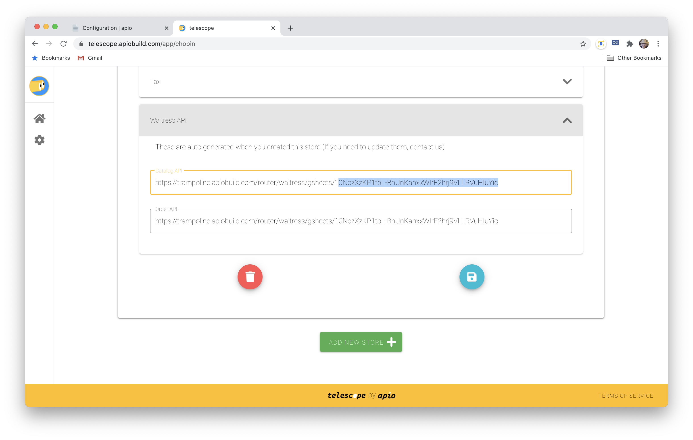

By default, [your store would look like below.](https://chopin.apiobuild.com/google-oauth2%7C106308532747537725517/3b99cc9c-6c28-45dd-9786-8521fe0a2e47) We are pretty sure you're not selling Cool Cat and Funny Cat. To add and update products, go to catalog google sheet.





Edit product details by updating the following fields on the catalog google sheet:





### name

Unique name/id starts with any alphabet and contains **only dashes (-), underscores (_), and alphanumeric are allowed** for each product. No spaces.

### nickname

Product names that will appear on the store page, they can be **any language, symbol, and even emoji 🤩**.

### description *(optional)*



More information about the product. Styling with markdown is supported.

### image_url



url of the product image(s). Multiple image urls can be separated by comma (,).

### price

Product price, no need to enter "$" (dollar sign).

### max_qty *(optional)*

Maximum quantity that **one customer** can buy. If max_qty = 0, it will show 'Coming Soon'

### category *(optional)*

To allow customer to filter products. Multiple categories can be separated by comma (,).

### hide

Enter "x" (or any other characters), this product will not appear on your store.

### no_tax

Enter "x" (or any other characters), sales tax won't apply to this product.
